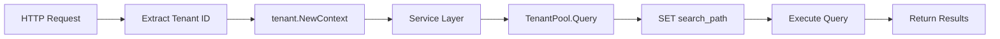

# Tenant Package Documentation

[](https://pkg.go.dev/crm-platform/pkg/tenant)
[](https://goreportcard.com/report/crm-platform/pkg/tenant)

The `tenant` package provides multi-tenant database isolation for SaaS applications using PostgreSQL schema-per-tenant architecture. It enables secure tenant data isolation, context-aware database operations, and seamless tenant provisioning.

## Table of Contents

- [Features](#features)
- [Quick Start](#quick-start)
- [Architecture](#architecture)
- [API Reference](#api-reference)
- [Examples](#examples)
- [Best Practices](#best-practices)
- [Testing](#testing)
- [Contributing](#contributing)

## Features

- **Complete Tenant Isolation** - PostgreSQL schema-per-tenant with automatic context switching
- **Zero-Configuration** - Seamless integration with existing database code
- **Type-Safe Operations** - Compile-time guarantees for tenant context
- **Schema Provisioning** - Automated tenant schema creation and template copying
- **Transaction Support** - Tenant-aware transactions with proper isolation
- **Context-Driven** - Go context-based tenant identification
- **High Performance** - Minimal overhead with connection pooling
- **Production Ready** - Comprehensive error handling and logging

## Quick Start

### Installation

```bash
go get crm-platform/pkg/tenant
```

### Basic Usage

```go
package main

import (
    "context"
    "log"
    
    "crm-platform/pkg/database"
    "crm-platform/pkg/tenant"
)

func main() {
    // Initialize your database pool
    config, _ := database.LoadConfigFromEnv()
    pool, _ := database.NewPool(context.Background(), config)
    
    // Create tenant-aware pool
    tenantPool := tenant.NewTenantPool(pool)
    defer tenantPool.Close()
    
    // Create tenant context
    ctx := context.Background()
    tenantCtx, err := tenant.NewContext(ctx, "550e8400-e29b-41d4-a716-446655440000")
    if err != nil {
        log.Fatal(err)
    }
    
    // All queries automatically execute in tenant schema
    rows, err := tenantPool.Query(tenantCtx, "SELECT * FROM contacts")
    if err != nil {
        log.Fatal(err)
    }
    defer rows.Close()
    
    // Process results...
}
```

## Architecture

### Schema-Per-Tenant Model

The tenant package implements a **schema-per-tenant** architecture where each tenant's data is completely isolated in separate PostgreSQL schemas:

```
Database: crm_platform
├── public (global tables: tenants, invitations)
├── tenant_550e8400-e29b-41d4-a716-446655440000
│   ├── contacts
│   ├── companies  
│   ├── deals
│   └── activities
└── tenant_123e4567-e89b-12d3-a456-426614174000
    ├── contacts
    ├── companies
    ├── deals
    └── activities
```

### Context Flow



### Components

| Component | Purpose | Responsibility |
|-----------|---------|----------------|
| **Context** | Tenant identification | Store/retrieve tenant ID from Go context |
| **Schema** | Schema management | Create, validate, and manage PostgreSQL schemas |
| **Pool** | Query execution | Tenant-aware database operations |

## API Reference

### Context Management

#### `NewContext(ctx context.Context, tenantID string) (context.Context, error)`

Creates a new context with tenant ID stored. The tenant ID must be a valid UUID.

```go
tenantCtx, err := tenant.NewContext(ctx, "550e8400-e29b-41d4-a716-446655440000")
```

**Parameters:**
- `ctx`: Parent context
- `tenantID`: Valid UUID string (36 characters with hyphens)

**Returns:**
- New context with tenant ID stored
- Error if tenant ID is invalid

#### `FromContext(ctx context.Context) (string, error)`

Extracts tenant ID from context.

```go
tenantID, err := tenant.FromContext(ctx)
```

**Returns:**
- Tenant ID string
- Error if tenant ID not found or invalid

#### `HasTenant(ctx context.Context) bool`

Checks if context contains a valid tenant ID.

```go
if tenant.HasTenant(ctx) {
    // Context has tenant
}
```

#### `MustFromContext(ctx context.Context) string`

Extracts tenant ID or panics. Use only when tenant is guaranteed to exist.

```go
tenantID := tenant.MustFromContext(ctx) // Panics if no tenant
```

### Schema Management

#### `GenerateSchemaName(tenantID string) string`

Converts tenant UUID to PostgreSQL schema name.

```go
schemaName := tenant.GenerateSchemaName("550e8400-e29b-41d4-a716-446655440000")
// Returns: "tenant_550e8400-e29b-41d4-a716-446655440000"
```

#### `SchemaExists(ctx context.Context, pool *database.Pool, schemaName string) (bool, error)`

Checks if a PostgreSQL schema exists.

```go
exists, err := tenant.SchemaExists(ctx, pool, "tenant_123")
```

#### `CreateSchema(ctx context.Context, pool *database.Pool, schemaName string) error`

Creates a new PostgreSQL schema with IF NOT EXISTS.

```go
err := tenant.CreateSchema(ctx, pool, "tenant_123")
```

#### `CopyTemplateSchema(ctx context.Context, pool *database.Pool, templateSchema, targetSchema string) error`

Copies complete table structure from template to new tenant schema.

```go
err := tenant.CopyTemplateSchema(ctx, pool, "tenant_template", "tenant_123")
```

### Tenant-Aware Database Operations

#### `NewTenantPool(pool *database.Pool) *TenantPool`

Creates a tenant-aware database pool wrapper.

```go
tenantPool := tenant.NewTenantPool(pool)
```

#### `Query(ctx context.Context, sql string, args ...interface{}) (pgx.Rows, error)`

Executes a query with automatic tenant isolation.

```go
rows, err := tenantPool.Query(ctx, "SELECT * FROM contacts WHERE company_id = $1", companyID)
```

#### `QueryRow(ctx context.Context, sql string, args ...interface{}) pgx.Row`

Executes a query that returns a single row.

```go
row := tenantPool.QueryRow(ctx, "SELECT name FROM contacts WHERE id = $1", contactID)
var name string
err := row.Scan(&name)
```

#### `Exec(ctx context.Context, sql string, args ...interface{}) (pgconn.CommandTag, error)`

Executes a command (INSERT, UPDATE, DELETE).

```go
tag, err := tenantPool.Exec(ctx, "INSERT INTO contacts (name, email) VALUES ($1, $2)", name, email)
```

#### `Begin(ctx context.Context) (*TenantTx, error)`

Starts a tenant-aware transaction.

```go
tx, err := tenantPool.Begin(ctx)
if err != nil {
    return err
}
defer tx.Rollback(ctx)

// All operations in this transaction are tenant-isolated
_, err = tx.Exec(ctx, "INSERT INTO contacts ...")
if err != nil {
    return err
}

err = tx.Commit(ctx)
```

## Examples

### Complete Tenant Provisioning

```go
func CreateTenant(ctx context.Context, pool *database.Pool, tenantID, orgName string) error {
    // 1. Create tenant context
    tenantCtx, err := tenant.NewContext(ctx, tenantID)
    if err != nil {
        return fmt.Errorf("invalid tenant ID: %w", err)
    }
    
    // 2. Generate schema name
    schemaName := tenant.GenerateSchemaName(tenantID)
    
    // 3. Create PostgreSQL schema
    err = tenant.CreateSchema(ctx, pool, schemaName)
    if err != nil {
        return fmt.Errorf("failed to create schema: %w", err)
    }
    
    // 4. Copy template structure
    err = tenant.CopyTemplateSchema(ctx, pool, "tenant_template", schemaName)
    if err != nil {
        return fmt.Errorf("failed to copy template: %w", err)
    }
    
    // 5. Create tenant-aware pool and insert initial data
    tenantPool := tenant.NewTenantPool(pool)
    
    _, err = tenantPool.Exec(tenantCtx, 
        "INSERT INTO organizations (name) VALUES ($1)", orgName)
    if err != nil {
        return fmt.Errorf("failed to create organization: %w", err)
    }
    
    return nil
}
```

### HTTP Middleware Integration

```go
func TenantMiddleware(next http.Handler) http.Handler {
    return http.HandlerFunc(func(w http.ResponseWriter, r *http.Request) {
        // Extract tenant ID from JWT, subdomain, or header
        tenantID := extractTenantFromRequest(r)
        
        // Create tenant context
        tenantCtx, err := tenant.NewContext(r.Context(), tenantID)
        if err != nil {
            http.Error(w, "Invalid tenant", http.StatusBadRequest)
            return
        }
        
        // Pass tenant context to next handler
        next.ServeHTTP(w, r.WithContext(tenantCtx))
    })
}

func ContactsHandler(tenantPool *tenant.TenantPool) http.Handler {
    return http.HandlerFunc(func(w http.ResponseWriter, r *http.Request) {
        // Context already has tenant from middleware
        contacts, err := getContacts(r.Context(), tenantPool)
        if err != nil {
            http.Error(w, err.Error(), http.StatusInternalServerError)
            return
        }
        
        json.NewEncoder(w).Encode(contacts)
    })
}

func getContacts(ctx context.Context, pool *tenant.TenantPool) ([]Contact, error) {
    // This query automatically executes in the correct tenant schema
    rows, err := pool.Query(ctx, "SELECT id, name, email FROM contacts")
    if err != nil {
        return nil, err
    }
    defer rows.Close()
    
    // Process results...
}
```

### Service Layer Integration

```go
type ContactService struct {
    pool *tenant.TenantPool
}

func NewContactService(pool *tenant.TenantPool) *ContactService {
    return &ContactService{pool: pool}
}

func (s *ContactService) CreateContact(ctx context.Context, contact *Contact) error {
    // Tenant context is passed through - no additional setup needed
    _, err := s.pool.Exec(ctx, 
        "INSERT INTO contacts (name, email, phone) VALUES ($1, $2, $3)",
        contact.Name, contact.Email, contact.Phone)
    return err
}

func (s *ContactService) GetContact(ctx context.Context, id int) (*Contact, error) {
    // Query automatically executes in correct tenant schema
    row := s.pool.QueryRow(ctx, "SELECT id, name, email FROM contacts WHERE id = $1", id)
    
    var contact Contact
    err := row.Scan(&contact.ID, &contact.Name, &contact.Email)
    if err != nil {
        return nil, err
    }
    
    return &contact, nil
}
```

### Transaction Usage

```go
func TransferContactsBetweenCompanies(ctx context.Context, pool *tenant.TenantPool, 
    contactIDs []int, fromCompanyID, toCompanyID int) error {
    
    tx, err := pool.Begin(ctx)
    if err != nil {
        return err
    }
    defer tx.Rollback(ctx)
    
    // Update contacts in transaction
    for _, contactID := range contactIDs {
        _, err = tx.Exec(ctx, 
            "UPDATE contacts SET company_id = $1 WHERE id = $2", 
            toCompanyID, contactID)
        if err != nil {
            return err // Automatic rollback via defer
        }
    }
    
    // Log the transfer
    _, err = tx.Exec(ctx, 
        "INSERT INTO audit_log (action, details) VALUES ($1, $2)",
        "contact_transfer", 
        fmt.Sprintf("Moved %d contacts from company %d to %d", 
            len(contactIDs), fromCompanyID, toCompanyID))
    if err != nil {
        return err
    }
    
    return tx.Commit(ctx)
}
```

## Best Practices

### ✅ Do's

1. **Always validate tenant context early**
   ```go
   func MyHandler(w http.ResponseWriter, r *http.Request) {
       if !tenant.HasTenant(r.Context()) {
           http.Error(w, "Missing tenant context", http.StatusBadRequest)
           return
       }
       // Continue with business logic
   }
   ```

2. **Use transactions for multi-table operations**
   ```go
   tx, err := tenantPool.Begin(ctx)
   if err != nil {
       return err
   }
   defer tx.Rollback(ctx) // Always defer rollback
   
   // Multiple operations...
   
   return tx.Commit(ctx)
   ```

3. **Handle tenant extraction errors gracefully**
   ```go
   tenantID, err := tenant.FromContext(ctx)
   if err != nil {
       log.Printf("Missing tenant context: %v", err)
       return ErrUnauthorized
   }
   ```

4. **Use connection pooling efficiently**
   ```go
   // Create one tenant pool per application
   tenantPool := tenant.NewTenantPool(globalPool)
   defer tenantPool.Close()
   
   // Reuse across requests
   ```

### ❌ Don'ts

1. **Don't bypass tenant isolation**
   ```go
   // ❌ DON'T: Direct pool access bypasses tenant isolation
   rows, err := globalPool.Query(ctx, "SELECT * FROM contacts")
   
   // ✅ DO: Use tenant pool
   rows, err := tenantPool.Query(ctx, "SELECT * FROM contacts")
   ```

2. **Don't ignore context propagation**
   ```go
   // ❌ DON'T: Create new background context
   func ProcessContact(tenantCtx context.Context) {
       go worker(context.Background()) // Loses tenant context!
   }
   
   // ✅ DO: Propagate tenant context
   func ProcessContact(tenantCtx context.Context) {
       go worker(tenantCtx) // Maintains tenant context
   }
   ```

3. **Don't hardcode schema names**
   ```go
   // ❌ DON'T: Hardcode schema names
   query := "SELECT * FROM tenant_123.contacts"
   
   // ✅ DO: Let the package handle schema switching
   query := "SELECT * FROM contacts" // Schema set automatically
   ```

### Performance Considerations

- **Connection Pooling**: The tenant pool reuses your existing connection pool efficiently
- **Search Path Overhead**: Minimal - search path is set once per query
- **Memory Usage**: No additional memory overhead per tenant
- **Query Performance**: No performance impact on actual queries

### Security Considerations

- **Tenant Isolation**: Complete schema-level isolation prevents data leakage
- **SQL Injection**: All schema names are validated and quoted
- **Context Validation**: Tenant IDs are validated as UUIDs
- **Error Handling**: No tenant information leaked in error messages

## Testing

### Unit Testing

```go
func TestTenantContext(t *testing.T) {
    tenantID := "550e8400-e29b-41d4-a716-446655440000"
    
    ctx := context.Background()
    tenantCtx, err := tenant.NewContext(ctx, tenantID)
    assert.NoError(t, err)
    
    extractedID, err := tenant.FromContext(tenantCtx)
    assert.NoError(t, err)
    assert.Equal(t, tenantID, extractedID)
}
```

### Integration Testing

```go
func TestTenantIsolation(t *testing.T) {
    // Setup test database
    pool := setupTestDB(t)
    tenantPool := tenant.NewTenantPool(pool)
    
    // Create two tenant contexts
    tenant1Ctx, _ := tenant.NewContext(context.Background(), "tenant-1-uuid")
    tenant2Ctx, _ := tenant.NewContext(context.Background(), "tenant-2-uuid")
    
    // Create schemas
    tenant.CreateSchema(context.Background(), pool, "tenant_tenant-1-uuid")
    tenant.CreateSchema(context.Background(), pool, "tenant_tenant-2-uuid")
    
    // Insert data for tenant 1
    _, err := tenantPool.Exec(tenant1Ctx, "INSERT INTO contacts (name) VALUES ($1)", "Tenant 1 Contact")
    assert.NoError(t, err)
    
    // Verify tenant 2 can't see tenant 1's data
    rows, err := tenantPool.Query(tenant2Ctx, "SELECT name FROM contacts")
    assert.NoError(t, err)
    
    var names []string
    for rows.Next() {
        var name string
        rows.Scan(&name)
        names = append(names, name)
    }
    
    assert.Empty(t, names) // Tenant 2 should see no data
}
```

### Test Utilities

```go
// Test helper for creating tenant contexts
func createTestTenant(t *testing.T) (context.Context, string) {
    tenantID := "550e8400-e29b-41d4-a716-446655440000"
    ctx, err := tenant.NewContext(context.Background(), tenantID)
    require.NoError(t, err)
    return ctx, tenantID
}

// Test helper for setting up isolated test environment
func setupTenantTest(t *testing.T) (*tenant.TenantPool, context.Context) {
    pool := setupTestDB(t)
    tenantPool := tenant.NewTenantPool(pool)
    
    ctx, tenantID := createTestTenant(t)
    schemaName := tenant.GenerateSchemaName(tenantID)
    
    // Create test schema
    err := tenant.CreateSchema(context.Background(), pool, schemaName)
    require.NoError(t, err)
    
    // Copy template if needed
    tenant.CopyTemplateSchema(context.Background(), pool, "test_template", schemaName)
    
    return tenantPool, ctx
}
```

## Error Handling

The package provides structured error handling with predefined error variables:

### Context Errors
```go
var (
    ErrTenantNotFound    = fmt.Errorf("context does not contain tenant key")
    ErrInvalidTenantType = fmt.Errorf("tenant key must be string")
    ErrNilContext        = fmt.Errorf("cannot extract from nil context")
    ErrBlankTenantID     = fmt.Errorf("tenant ID cannot be blank")
    ErrInvalidTenantID   = fmt.Errorf("invalid tenant ID format")
)
```

### Schema Errors

```go
var (
    ErrSchemaNotFound       = fmt.Errorf("schema does not exist")
    ErrInvalidSchema        = fmt.Errorf("schema name invalid")
    ErrBlankSchemaName      = fmt.Errorf("schema name cannot be blank")
    ErrSetSearchPathFailure = fmt.Errorf("failed to set search path")
    ErrFailedSchemaCreation = fmt.Errorf("failed to create schema")
    ErrTemplateNotFound     = fmt.Errorf("template schema does not exist")
    ErrTableCopyFailure     = fmt.Errorf("failed to copy table")
    ErrSeedDataFailure      = fmt.Errorf("failed to copy seed data")
)
```

### Pool Errors

```go
var (
    ErrFailedTransaction = fmt.Errorf("failed to begin transaction")
    ErrSchemaWrapFailure = fmt.Errorf("failed to wrap SQL with tenant schema")
)
```

### Error Handling Patterns

```go
import (
    "errors"
    "crm-platform/pkg/tenant"
)

// Check for specific error types using errors.Is
tenantID, err := tenant.FromContext(ctx)
if err != nil {
    if errors.Is(err, tenant.ErrTenantNotFound) {
        // Handle missing tenant
        return ErrUnauthorized
    }
    if errors.Is(err, tenant.ErrNilContext) {
        // Handle nil context
        return ErrBadRequest
    }
    return fmt.Errorf("tenant extraction failed: %w", err)
}

// Validate tenant context before operations
if !tenant.HasTenant(ctx) {
    return tenant.ErrTenantNotFound
}

// Handle schema errors
err := tenant.CreateSchema(ctx, pool, schemaName)
if err != nil {
    if errors.Is(err, tenant.ErrInvalidSchema) {
        return fmt.Errorf("invalid schema name provided: %w", err)
    }
    return fmt.Errorf("schema creation failed: %w", err)
}

// Handle template copying errors
err = tenant.CopyTemplateSchema(ctx, pool, "template", "target")
if err != nil {
    if errors.Is(err, tenant.ErrTemplateNotFound) {
        return fmt.Errorf("template schema missing: %w", err)
    }
    return fmt.Errorf("template copy failed: %w", err)
}
```

### Error Wrapping

All functions use proper error wrapping with fmt.Errorf("%w", err) to maintain error chains:

```go
// Example of wrapped error handling
if err := operation(); err != nil {
    var schemaErr *tenant.SchemaError
    if errors.As(err, &schemaErr) {
        // Handle schema-specific error
        log.Printf("Schema error: %v", schemaErr)
    }
    
    // Check for specific error in chain
    if errors.Is(err, tenant.ErrSetSearchPathFailure) {
        // Handle search path failure
        return handleSearchPathError(err)
    }
    
    return fmt.Errorf("operation failed: %w", err)
}
```

## Migration Guide

### From Direct Database Access

**Before:**
```go
rows, err := pool.Query(ctx, "SELECT * FROM tenant_123.contacts")
```

**After:**
```go
tenantCtx, _ := tenant.NewContext(ctx, "tenant-uuid")
rows, err := tenantPool.Query(tenantCtx, "SELECT * FROM contacts")
```

### From Manual Schema Management

**Before:**
```go
_, err := pool.Exec(ctx, "SET search_path TO tenant_123, public")
rows, err := pool.Query(ctx, "SELECT * FROM contacts")
```

**After:**
```go
tenantCtx, _ := tenant.NewContext(ctx, "tenant-uuid")
rows, err := tenantPool.Query(tenantCtx, "SELECT * FROM contacts")
```
